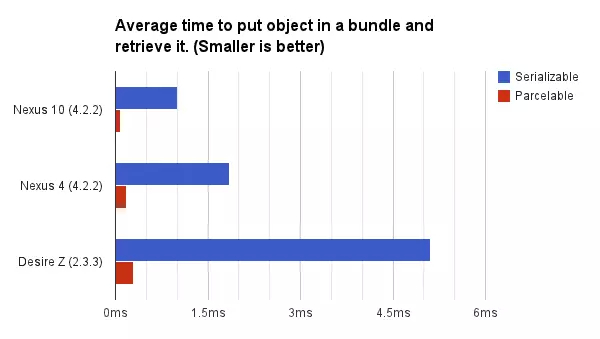

# 什么是对象的序列化
对象序列化就是将对象的状态信息转化为可以存储或者传输的形式的过程，这些信息包括Class信息、继承关系信息、访问权限、变量类型以及数值信息等。
将序列化对象写入文件后，也可以从文件中读取出来并对其进行反序列化操作。通过反序列化将对象的信息全部获取，然后可以在内存中根据这些信息新建对象。
Java提供了Seriabizable接口来实现对象序列化。当对象在保存对象时，会把其状态保存为一组字节，反序列化时再将这些还原成对象再内存当中重新创建。需要注意的是**类中的静态变量是不会被序列化的**，因为它不属于对象而是属于类。
虽然Java提供了Serializable接口来实现，但是它的性能较低，Android则重新设计了一套更加轻量且高效的对象序列化和反序列化的机制也就是Parcelable。下面我们就针对Serializable和Parcelable来分别进行介绍。
# Serializable
## Serializable接口的使用
```
public class User implements Serializable {

    private String name;

    private int age;

    private transient String gend;

    private static final long serialVersionUID= -34975938475934934L;


    public String getGend() {
        return gend;
    }

    public void setGend(String gend) {
        this.gend = gend;
    }

    public String getName() {
        return name;
    }

    public void setName(String name) {
        this.name = name;
    }

    public int getAge() {
        return age;
    }

    public void setAge(int age) {
        this.age = age;
    }
}


```


```
//序列化
ObjectOutputStream outputStream = new ObjectOutputStream(new FileOutputStream("Serializable.txt"));
outputStream.writeObject(user);
outputStream.close();
```


```
//反序列化
ObjectInputStream inputStream = new ObjectInputStream(new FileInputStream("Serializable.txt"));
User u = (User) inputStream.readObject();
inputStream.close();
```

对应的结果：
```
序列化前：User{name='Tom', age=25, gend='male'}
序列化后：User{name='Tom', age=25, gend='null'}
```
## Serializable使用说明
### transient关键字
该关键字的作用就是阻止该变量被序列化到文件中，在被反序列化后transient变量的值被设为初始值，例如int是0，bool值是false，对象类型的则是null。从上面的实例中我们也能看出，gend变量最终被反序列化以后的值是null。
### serialVersionUID（序列化ID）
Java虚拟机是否允许反序列化，不仅取决于反序列化类的路径和功能代码中使用的类是否是一致的。同时也会比较两个类的serialVersionUID是否一致。
假如我们不指定seriaVersionUID，先将User序列化，然后再将User反序列化我们就会得到如下报错：
```
java.io.InvalidClassException: com.example.User; local class incompatible: stream classdesc serialVersionUID = 7460070630995626692, local class serialVersionUID = -1719492402693942784
	at java.io.ObjectStreamClass.initNonProxy(ObjectStreamClass.java:616)
	at java.io.ObjectInputStream.readNonProxyDesc(ObjectInputStream.java:1843)
	at java.io.ObjectInputStream.readClassDesc(ObjectInputStream.java:1713)
	at java.io.ObjectInputStream.readOrdinaryObject(ObjectInputStream.java:2000)
	at java.io.ObjectInputStream.readObject0(ObjectInputStream.java:1535)
	at java.io.ObjectInputStream.readObject(ObjectInputStream.java:422)
	at com.example.MainDemo.main(MainDemo.java:24)
```
原来如果我们不指定serialVersionUID的话，编译器会默认给我们指定一个。而这个值是根据类的信息入方法名称、字段名称等计算hash出来的。所以说如果类一旦发生变化，这个值就肯定会跟随者变化而变化。所以我们必须要养成良好的习惯给serialVersionUID指定值，这样才能保证类前后变化以后尽可能最大程度还原现场。
# Parcelable
## Parcelable使用
```
public class User implements Parcelable {

  public User() {
  }

  private String name;

  private int age;

  private String gend;

  private Wallet wallet;

  public Wallet getWallet() {
    return wallet;
  }

  public void setWallet(Wallet wallet) {
    this.wallet = wallet;
  }

  public String getName() {
    return name;
  }

  public void setName(String name) {
    this.name = name;
  }

  public int getAge() {
    return age;
  }

  public void setAge(int age) {
    this.age = age;
  }

  public String getGend() {
    return gend;
  }

  public void setGend(String gend) {
    this.gend = gend;
  }

  @Override public int describeContents() {
    return 0;
  }

  @Override public void writeToParcel(Parcel dest, int flags) {
    dest.writeString(this.name);
    dest.writeInt(this.age);
    dest.writeString(this.gend);
    dest.writeParcelable(this.wallet, flags);
  }

  protected User(Parcel in) {
    this.name = in.readString();
    this.age = in.readInt();
    this.gend = in.readString();
    this.wallet = in.readParcelable(Wallet.class.getClassLoader());
  }

  public static final Creator<User> CREATOR= new Creator<User>() {
    @Override public User createFromParcel(Parcel source) {
      return new User(source);
    }

    @Override public User[] newArray(int size) {
      return new User[size];
    }
  };
}
```

## Parcelable使用说明
* **writeToParcel(Parcel,int)**:将当前对象写入序列化结构中，其中flags标识只有0或者1两种值。为1的时候当前对象需要作为返回值返回，不能立即释放资源，基本上所有情况都为1.
* **describeContents**:返回当前对象的内容描述。如果含有文件描述符，返回1，否则返回0。几乎所有情况都为0。
* **protected 构造方法**:从序列化后的对象中创建原始对象。
* **CREATOR**:根据官方文档的说法，在实现Parcelable接口的嘶吼必须初始化一个非空的静态字段CREATOR实现Parcelable.Creator接口用来从Parcel中生成实例。

总的来说序列化是通过实现writeToParcel方法来完成。反序列化操作是通过构造函数里调用各种read方法来实现。Parcelable的实现较为复杂，不如Serializable使用起来方便。但是我们也可以发现其中代码比较模板化，AndroidStudio里有对应的插件可以帮助我们快速的实现Parcelable所需要的全部方法。


# Serializable和Parcelable对比与总结
* Serializable与Parcelable之间最大的区别在于存储的媒介不同，Serializable使用I/O读写存储在硬盘上，Parcelable是直接在内存中进行读写。
* Serializable大量使用反射，Parcelable自己实现封送和解封操作不需要用反射，数据也是存放在Native内存中，效率更高。

摘取一张网上对比两者之间的效率图：


一般情况下我们尽可能使用Parcelable，但是如果不得不做本地持久化存储的时候就使用Serializable吧。


# 参考链接：
[深入分析Java的序列化和反序列化](https://www.hollischuang.com/archives/1140)
[张绍文 Android开发高手课](https://time.geekbang.org/column/article/76985)
[Serializable 都这么牛逼了，Parcelable，我还要你何用？](https://juejin.im/post/5a24fd8151882531ea651c37)
[JAVA序列化原理解析](https://www.jianshu.com/p/3e3d86716f76)
[Parcelable最强解析](https://juejin.im/post/5a3b24ab6fb9a04515440bd7)