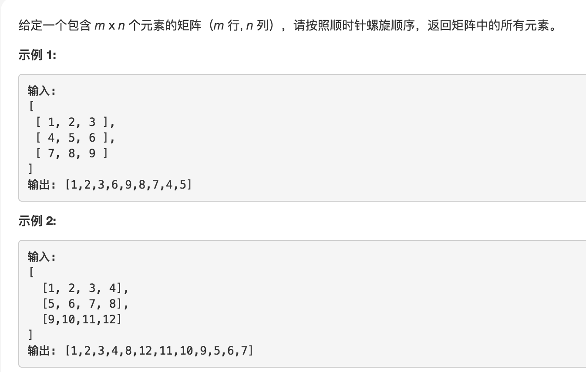
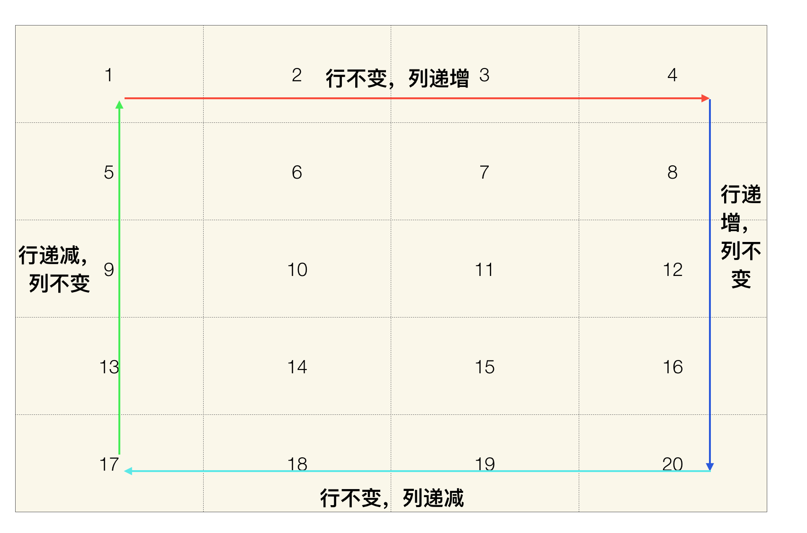

# 1.题目

# 2.分析

上图展示了一轮完整的顺时针螺旋遍历的过程,整个过程可以分为如图所示的四个阶段，而这四个阶段我们则只需要考虑，是行还是列在变化，是递增还是递减。所以代码当中分别用* isHoriOrVer**和** isIncrease*两个布尔变量来分别表示。
同时，我们需要记录下来我们遍历过的行和列。因为没一轮遍历都是先遍历最靠前的行（列），再遍历最后靠后的行（列）。所以这里我们分别用left,right,top,bottom来分别表示。
# 3.代码实现
```
public List<Integer> spiralOrder(int[][] matrix) {
    if (matrix.length != 0 && matrix[0].length != 0) {
        //横向还是纵向，初始是横向
        boolean isHoriOrVer = true;

        //是否是增长序列，初始是增长
        boolean isIncrease = true;

        int top = 0;
        int bottom = matrix.length - 1;

        int left = 0;
        int right = matrix[0].length - 1;
		  //默认从第一行第一列开始
        int row = top;
        int column = left;

        int length = matrix.length * matrix[0].length;
        List<Integer> list = new ArrayList<>(length);

        for (int i = 0; i < length; i++) {
            if (isHoriOrVer) {
                if (isIncrease) {
                    list.add(matrix[row][column++]);
                    if (column > right) {
                        row++;
                        top++;
                        column = right;
                        isHoriOrVer = false;
                        isIncrease = true;
                    }
                } else {
                    list.add(matrix[row][column--]);
                    if (column < left) {
                        row--;
                        bottom--;
                        column = left;
                        isHoriOrVer = false;
                        isIncrease = false;
                    }
                }
            } else {
                if (isIncrease) {
                    list.add(matrix[row++][column]);
                    if (row > bottom) {
                        column--;
                        right--;
                        row = bottom;
                        isIncrease = false;
                        isHoriOrVer = true;
                    }
                } else {
                    list.add(matrix[row--][column]);
                    if (row < top) {
                        column++;
                        left++;
                        row = top;
                        isHoriOrVer = true;
                        isIncrease = true;
                    }
                }
            }
        }

        return list;

    }

    return new ArrayList<>();
}

```


